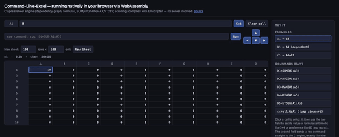

# Command-Line Excel: Spreadsheet Project

**Author:** Prince\
**Start Date:** 01-Feb-2025

---

## 📌 Overview

This project is a command-line spreadsheet program developed in C, supporting integer-only cell values, formulas, and efficient recalculation using a Directed Acyclic Graph (DAG). It mimics core functionalities of Excel such as cell assignment, formula evaluation, and dependency tracking, all within a terminal interface.

---

## 🎬 Live Demo

Compiled to WebAssembly with Emscripten and running entirely in the browser, no server involved -- **[Try it live](https://evans-prince.github.io/Command-Line-Excel/)**



---

## ✨ Features

- 📊 **Spreadsheet Grid**: Supports sizes from 1x1 up to 999x18278 (A1 to ZZZ999).
- 🔗 **Formula Evaluation**: Supports arithmetic operations and range-based functions (e.g., `SUM(A1:A5)`).
- 🔄 **Efficient Recalculation**: Uses topological sorting and a calculation chain for updating only necessary cells.
- ♻️ **Dependency Management**: Tracks dependencies and dependents for each cell using CellRange structs.
- ⛔ **Error Handling**: Detects circular references, invalid inputs, and handles edge cases like division by zero.
- 🧪 **Testing Suite**: Modular unit tests for formula parsing, input handling, and recalculation.
- 🧱 **Modular Design**: Divided into reusable modules for better maintainability and scalability.

---

## 🛠️ Design Structure

### Spreadsheet Core

- `cell** grid`: 2D array for cells.
- `calculation_chain[]`: Optimized recalculation order.
- `CommandStatus`: Stores status and execution time of last command.

### Input Handling

- Tokenizes and classifies inputs using enums.
- Validates syntax for cell assignments, formulas, function calls, and scroll commands.

### Recalculation Engine

- Dirty flag mechanism for tracking updates.
- Topological sorting to determine update order.
- Selective recalculation based on dependencies.

### Error Handling

- Invalid syntax detection.
- Circular reference prevention.
- Graceful handling of undefined operations (e.g., `A1=10/0`).

---

## 🤩 Directory Structure

```plaintext
.
├── include/               # Header files
│   ├── spreadsheet.h
│   ├── recalculation.h
│   ├── input_handler.h
│   └── ...
├── src/                   # Source files
│   ├── spreadsheet.c
│   ├── recalculation.c
│   ├── input_handler.c
│   └── ...
├── lib/                   # Utility functions
│   └── utils.c
├── tests/                 # Unit tests
│   ├── test_input.c
│   ├── test_formula.c
│   └── ...
├── Makefile               # Build automation
└── report/                # LaTeX report files
    └── report.pdf
```

---

## How to Run 🚀

### Prerequisites

A Linux, macOS, or Windows system with:
- GCC (GNU Compiler Collection)
- `make` or `mingw32-make`
- `pdflatex` for LaTeX report generation (optional)


### 🔢 Build & Run Commands

#### Linux/macOS:
```bash
# Clone the repository
git clone https://github.com/evans-prince/Command-Line-Excel.git
cd Command-Line-Excel/Command-Line-Excel

# Build the project
make

# Run the program
./target/release/spreadsheet 999 18278
```

#### Windows:
```bash
# Open Command Prompt (cmd) or Git Bash

# Clone the repository
git clone https://github.com/evans-prince/Command-Line-Excel.git
cd Command-Line-Excel\Command-Line-Excel

# Build the project
mingw32-make

# Run the program
.target/release/spreadsheet.exe 999 18278
```

### 📉 Optional Commands
```bash
# Run provided tests (Linux/macOS)
make test

# Run tests on Windows
mingw32-make test

# Clean build files
make clean         # Linux/macOS
mingw32-make clean # Windows
```

---

## 🔗 Project Links

- 📁 **GitHub Repository**: [Command-Line Excel](https://github.com/evans-prince/Command-Line-Excel)
- 📽️ **Demo Video**: [Watch Demo](https://csciitd-my.sharepoint.com/:v:/g/personal/ph1221248_iitd_ac_in/EYGqIFa5qNRIl2LBnGHC8h8BVRATkNtxBRx4TYOI_3kHiQ?e=2s2BGr)

---

## 📣 Contributions

This project was collaboratively developed by:

- 👨‍💻 Prince
- 👨‍💻 Aditya

---

## 📞 Contact

If you'd like to know more or contribute, feel free to open an issue or contact us via GitHub!

